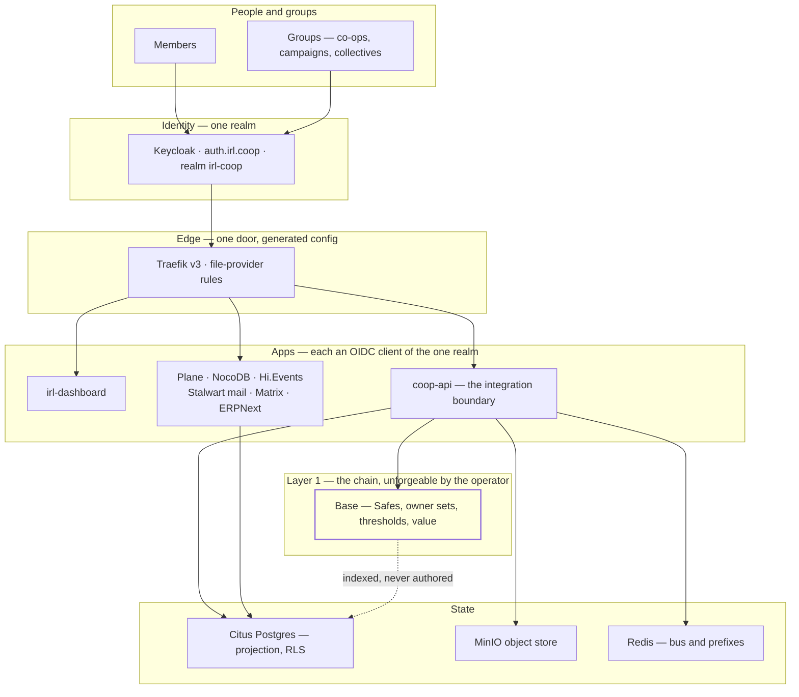
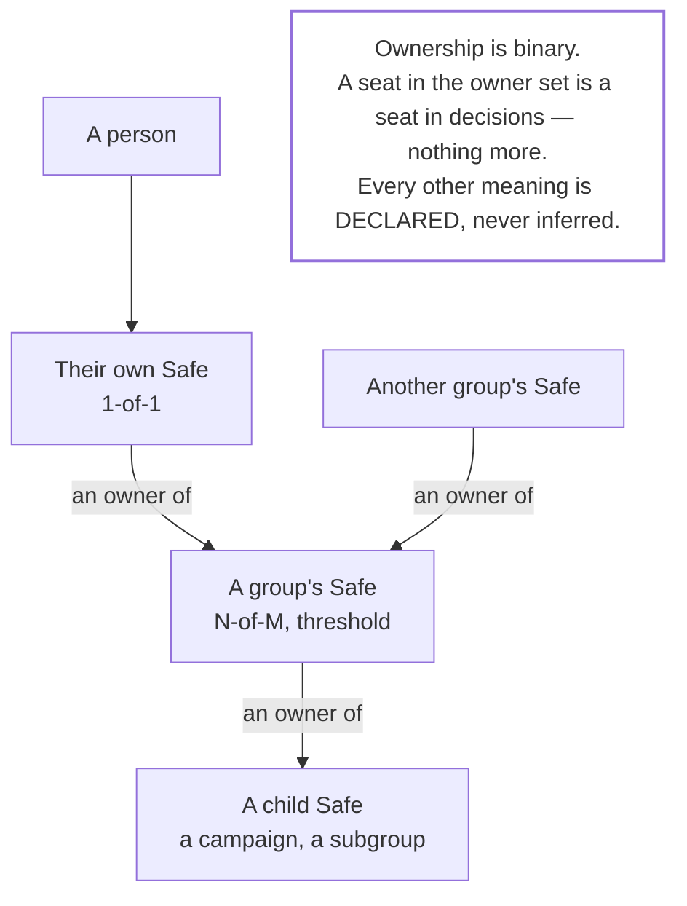
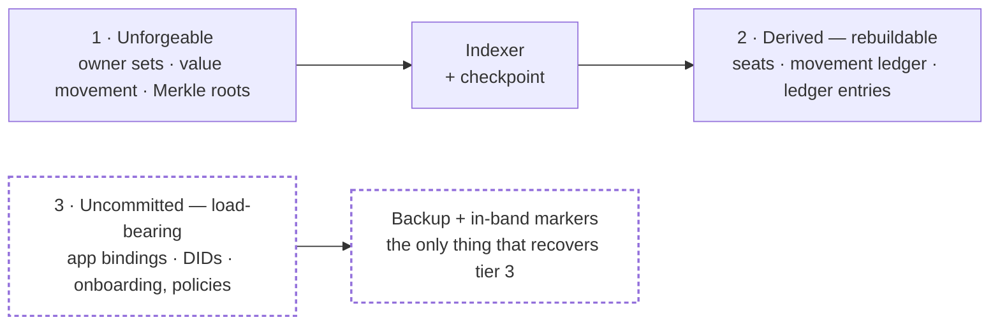
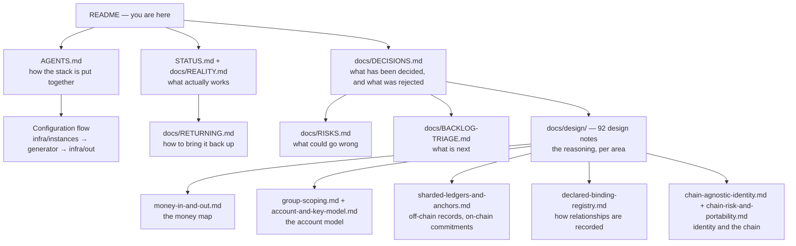

# irl.coop — a sovereign stack for cooperatives

**Status: work in progress. This is a research stack, not a service you can sign up for.**
It runs, it has real users in a supervised pilot, and large parts of what it promises are designed
rather than built. [What works today](#what-works-today--and-what-does-not) says which, and
[`docs/REALITY.md`](docs/REALITY.md) says it domain by domain with the evidence.

currently deployed as a proof-of-concept at [irl.coop](https://irl.coop)
**Please do not store any sensitive data or use any money you can't afford to lose**

---

## 1. Why this exists

Coops, mutual-aid groups, unions, and at-risk collectives depend on infrastructure that can be
withdrawn from them — a platform account, a payment processor, a bank, a hosting provider. The
design starts from a different premise:

> **A group's authority should be a threshold of its own members' keys, and nothing else should be
> able to move its money or change who is in it.**

Everything below follows from that. Hardware enclaves and cloud key custody are ruled out — they
create exactly the compellable party the design exists to avoid. What is left is mathematics:
thresholds, proofs, and a public chain that cannot be quietly edited.

---

## 2. The commitments that do not move

| Commitment | Consequence |
|---|---|
| **No TEEs, no cloud KMS, no Lit** | authority is a threshold of keys the members hold. Pure crypto only |
| **The platform never holds or intermediates member funds** | it is software, not a custodian — and not a money transmitter |
| **Authority is a threshold** | no single operator, server, or backend can act alone, by construction |
| **Enforcement lives at the database** | Postgres row-level security, not application checks |
| **Groups are autonomous; the coop is a steward, not a root** | a group can leave with its identity and its keys |
| **Identity is chain-agnostic; a chain is a binding** | moving chains is a rebinding, not a re-founding |
| **The on-chain footprint is deliberately small** | only authority and value. A small footprint is what makes an exit possible |

---

## 3. The stack at a glance

Deployment is declarative. `infra/instances/dev/` is the source of truth, a generator emits the
compose files and edge rules into `infra/out/`, and `infra/scripts/stack-up.sh` brings the whole
thing up idempotently at boot. **Nothing is hand-edited in `infra/out/`.**
See [`AGENTS.md`](AGENTS.md) for the full configuration flow.

---

## 4. The account model

One idea carries the whole thing: **an account is a threshold contract, and accounts compose.**
A person is a 1-of-1 Safe. A group is the same contract with N-of-M owners. A group is a member of
another group because its Safe sits in the other's owner set.

Two consequences worth knowing early:

- **A Safe must never require unanimity** (`threshold ≤ owners − 1`). Otherwise one lost or
  unreachable key can freeze the account forever — and someone who seeded a group could never be
  voted out. This is enforced by a guard, not by convention.
- **Joining a group means becoming an owner**, so the group grows by changing its own owner set.
  That is also the cleanest statement of what a cooperative *is* here.

---

## 5. The three tiers of fact

The most useful lens in this repository, and the one that keeps honesty cheap. A fact lives in one
of three places, and only the first two are recoverable.

**Tier 3 is the trap.** It looks like configuration and behaves like state: the mapping from a group
to its Plane project, its Matrix room, and its phone number. None of it is on-chain, none of it is
derivable, and all of it is lost if the database is. Committing a fact makes it *unforgeable* — it
does not make it *recoverable*. Those are two different properties and they need two different
mechanisms. See [`docs/design/external-bindings-resilience.md`](docs/design/external-bindings-resilience.md)
and the interactive [`docs/design/two-layer-map.html`](docs/design/two-layer-map.html).

---

## 6. Money

The shape of every money move, end to end. Note how much of the middle is deliberately not ours.

```mermaid
flowchart LR
  BUYER["A buyer<br/>card · Venmo · USDC"] --> RAIL["A rail<br/>its own app, behind a seam"]
  RAIL --> ROUTER["Router contract<br/>one immutable destination"]
  ROUTER -->|"sweep — permissionless"| SAFE["The group's Safe on Base<br/>the book of record"]
  SAFE --> POOL["Shielded pool<br/>commitments and nullifiers"]
  POOL -->|"a ratified split"| MEMBER["A member's earnings Safe"]
  MEMBER -->|"batched, by swap"| OUT["Their own account elsewhere<br/>Tezos · Gnosis · a card"]

  classDef todo fill:none,stroke-width:2px,stroke-dasharray:4 3
  class POOL,OUT todo
```

Two rules that shape everything:

- **A receipt says *funds arrived*, never *funds are final*.** A P2P rail settles partially and can
  reverse weeks later; that window is why a fund exists to absorb it.
- **The vendor never enters the core.** A provider's name lives in its own app; the core knows only
  "a rail, id X, at a URL". Swapping a provider is configuration, not a refactor — with one
  deliberate exception, below.

---

## 7. The provider seams — and the one that does not move

Six seams, five of them hot-swappable. The sixth is the whole risk.

| Seam | Replaceable by | Status |
|---|---|---|
| Fiat on-ramp | config | built — this is the reference implementation |
| Cross-chain swap | config | designed |
| Card / fiat access | config | designed |
| RPC provider | config | to apply |
| Chain data / indexer | config | designed |
| **The chain itself** | **not possible** | authority and value live on-chain |

Because the chain is the one dependency that cannot be flipped, the strategy is not a better chain —
it is **portability**: a minimal on-chain footprint, a rehearsed exit, and identity that survives a
move. See [`docs/design/chain-risk-and-portability.md`](docs/design/chain-risk-and-portability.md)
and [`docs/design/provider-seams.md`](docs/design/provider-seams.md).

---

## 8. What works today — and what does not

This section is the point of the repository being honest. The stack runs; a good deal of what it
promises is design. Full evidence, domain by domain, in [`docs/REALITY.md`](docs/REALITY.md).

| Works, verified | Designed but never exercised | Not built |
|---|---|---|
| One identity realm and zero-click SSO across apps | The Tier-2 contribution ledger (code exists, **zero rows**) | **Nothing signs a value transfer out of a Safe** — distributions do not exist |
| Groups, seats, roles, and group-scoped grants | Proposals and votes (**zero proposals**) | The shielded pool |
| Row-level security across the coop schema | The on-chain anchoring path (nothing has anchored) | The declared-binding registry |
| Mail — all four ports answering externally | The payment rail — **four attempts, all failed** | Chain indexing, and the card rail |
| Files, docs, maps basemap, Matrix chat | | Per-member Safe ownership — every Safe is currently owned 1-of-1 by a *published* test key |

Three findings that a newcomer should know immediately, because they are load-bearing:

1. **There is no backup anywhere.** Every data store is one failure from gone. This is R-07 in
   [`docs/RISKS.md`](docs/RISKS.md), and it gates anything involving real money.
2. **The projection is only partly rebuildable.** See §5 — tier 3 is not.
3. **`docs/REALITY.md` records six contradictions** between what the documentation claims and what
   the code does, including a contract cited in two design notes that does not exist.

The single largest single piece of genuinely new code required for a working payout flow is a
distribution run: reading a ratified split and signing threshold-approved transfers out of a group
Safe. Nothing in the codebase does that today.

---

## 9. How to read this repository

**The design notes that carry the most weight, linked** — the diagram above names them, these are
clickable:

- [`money-in-and-out.md`](docs/design/money-in-and-out.md) — the money map, what flows and what blocks what
- [`account-and-key-model.md`](docs/design/account-and-key-model.md) — accounts, guards, reserved powers, formation defaults
- [`group-scoping.md`](docs/design/group-scoping.md) — Layer 1 truth versus Layer 2 projection
- [`sharded-ledgers-and-anchors.md`](docs/design/sharded-ledgers-and-anchors.md) — off-chain records, on-chain commitments
- [`declared-binding-registry.md`](docs/design/declared-binding-registry.md) — how relationships and external bindings are recorded
- [`chain-agnostic-identity.md`](docs/design/chain-agnostic-identity.md) — identity that survives a chain move
- [`chain-risk-and-portability.md`](docs/design/chain-risk-and-portability.md) — the one dependency that cannot be swapped
- [`adversary-models-and-sector-fit.md`](docs/design/adversary-models-and-sector-fit.md) — who this is for, and against what
- [`artist-collective-end-to-end.md`](docs/design/artist-collective-end-to-end.md) — a single story traced end to end through the stack

**If you are continuing research, four registries are the on-ramp:**

- [`docs/DECISIONS.md`](docs/DECISIONS.md) — settled, tentative, open, and *rejected* decisions, with
  the reasons. The rejected list is as useful as the settled one.
- [`docs/RISKS.md`](docs/RISKS.md) — ranked, with mitigations and what would close each.
- [`docs/BACKLOG-TRIAGE.md`](docs/BACKLOG-TRIAGE.md) — what is parked, and why.
- Every design note ends with **Open questions**. That is where the work is.

**Where the hard, unsolved problems live:** the privacy-versus-compliance boundary of the shielded
pool; making a chain exit rehearsed rather than theoretical; and recovering tier-3 bindings without
a backup. None of these is settled.

---

## 10. Running it

[`docs/RETURNING.md`](docs/RETURNING.md) is the restart guide, and
[`docs/SYSTEM-MAP.md`](docs/SYSTEM-MAP.md) is the inventory.
[`docs/PAYMENTS-SETUP.md`](docs/PAYMENTS-SETUP.md) is the first-time runbook for the payment rail,
including what is missing before real money can move.
`infra/scripts/stack-up.sh` brings every pillar up idempotently; `irl-coop-stack.service` runs it at
boot.

**Secrets.** Two tiers, and neither belongs in the tree as plaintext. Most secrets are *derived* —
HKDF from a single master key that never leaves the host. External secrets we cannot derive live in
an ansible vault (AES256 ciphertext, deliberately committed). `infra/instances/dev/certs/` and
`.env*` files are gitignored. Do not add a credential to any document, including this one.

**Not in this repository:** the master key, the vault password, and the host's `.env`. A clone is
not a running system — several services need those values to work at all.

---

## 11. Standing constraints

- **Do not use TEEs, Lit, or cloud KMS anywhere.** Pure cryptography only.
- **Do not let the platform hold or intermediate member funds** — it is the single decision that
  keeps every other money property intact.
- **Do not hand-edit `infra/out/`** — it is generated, and the generator deletes it on every run.
- **Do not put a credential in a document.** None should ever be added to one.
- Design notes are records of reasoning at a point in time. Where they disagree with the code, the
  code wins — and the disagreement is worth recording rather than smoothing over.

---

## 12. Layout

| Path | What |
|---|---|
| `apps/` | each service, as its own app — `coop-api`, the rails, the dashboard, custom images |
| `infra/instances/dev/` | **the declarative source of truth** — instance, apps, per-app specs |
| `infra/build/` | the generator and the derived-secret module |
| `infra/out/` | generated; gitignored; never edited |
| `contracts/` | the on-chain side — the router, the anchor registry, Safe modules, per-chain facts |
| `docs/` | status, decisions, risks, and the operational runbooks |
| `docs/design/` | the design notes — where the reasoning lives |

---

*The forward-looking design in [`MASTER_PLAN.md`](MASTER_PLAN.md) is the v4.0 architecture document.
It is a useful historical record of the plan as written; where it disagrees with the design notes or
the code, those are current and it is not.*
