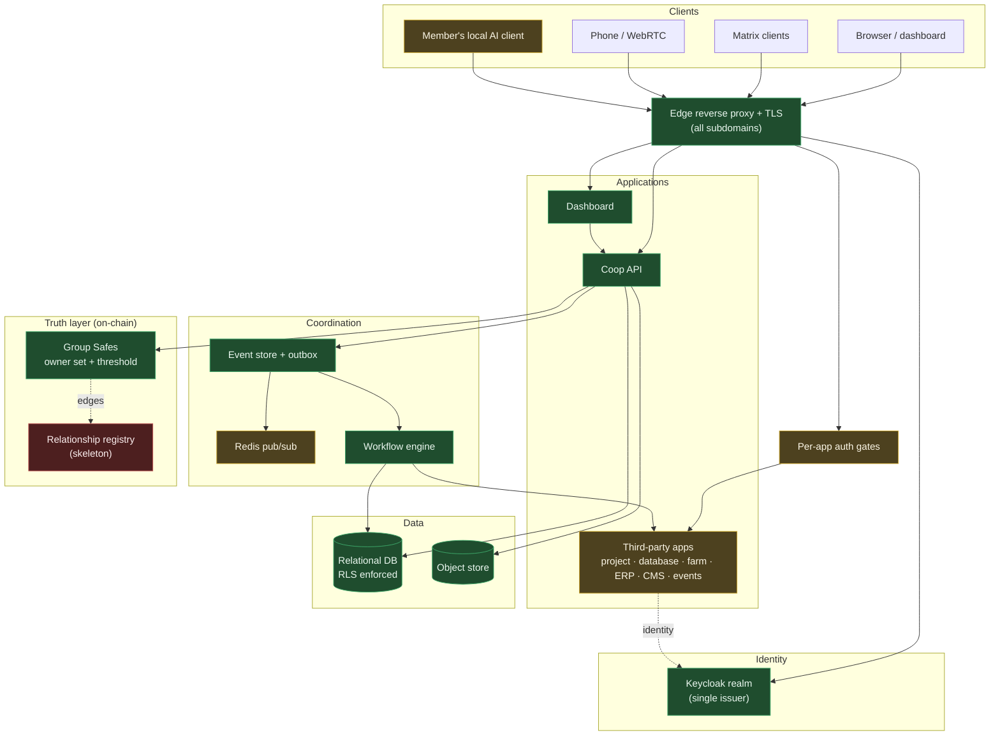

# SYSTEM-MAP.md — how the system is put together

Status: checkpoint map · 2026-09-29.
Companion to `REALITY.md` (what works) and `DECISIONS.md` (what was decided).
This document contains **no endpoints, no credentials, and no production topology
details** — it describes shape and boundaries only.

## 1. The intended layers, in plain language

1. **Clients** — a browser dashboard that embeds the group's apps in one place, plus
   Matrix clients for chat, a phone/WebRTC surface, and (eventually) a member's own
   local AI client talking to the platform's tool endpoint.
2. **Edge** — one reverse proxy terminates TLS for every subdomain and hands each
   hostname to the right upstream. Some upstreams sit behind an authentication gate.
3. **Identity** — a single Keycloak realm is the issuer for every application.
   Google sign-in is *brokered* through it, so no app talks to Google directly.
4. **Applications** — a coop API (the platform's own service) and a dashboard (the
   group's home), alongside third-party apps (project tool, database tool, farm tool,
   ERP, CMS, event ticketing) that each consume the same identity.
5. **Coordination** — a durable event store plus an outbox, a pub/sub channel, and a
   workflow engine that runs provisioning, digests, and sync jobs.
6. **Data** — one relational database shared by the platform services with
   row-level security as the enforcement point, one Redis, and one object store.
7. **Truth layer (on-chain)** — every account is meant to be a Safe. The Safe's owner
   set and threshold are the authoritative record of *who may act*; the database is a
   rebuildable projection. The relationship graph between groups lives here as
   declared, committed edges.
8. **Infrastructure** — a declarative instance tree is the source of truth; a
   generator emits the deployment artifacts; nothing generated is hand-edited.

The intended dividing line throughout: **the database is a projection, the chain is
truth, and the group graph is declared rather than inferred.**

## 2. Components and data flow

**Legend — read this before trusting the diagram.**
- **Green (implemented, verified):** seen working, with a test or a deployment record.
- **Amber (implemented, not verified):** the code is present and plausibly wired, but
  there is no end-to-end demonstration.
- **Red (proposed / planned):** designed, not built.

The relationship registry is **red**: `CoopRegistry.sol` exists as a skeleton whose
membership-append function is an empty placeholder, and none of the four relationship
edge types are implemented. The graph is the aspiration, not the current state.

## 3. Component inventory

| Component | Purpose | Location | Data it owns | Identity/auth | Authorization boundary | Dependencies | Operational status | Evidence |
|---|---|---|---|---|---|---|---|---|
| Edge proxy | TLS termination + routing for every subdomain | `infra/instances/dev/apps/traefik.yaml`; generated dynamic config | Routing rules, certs | n/a | The outermost network boundary | Docker; generated config | Running | Generated config is live; restart required after regeneration |
| Keycloak | Single identity issuer; brokers Google | `apps/keycloak.yaml` | User accounts, clients, roles | Itself | Identity boundary for every app | Own database | Running | Canonical issuer verified through the edge |
| Coop API | The platform's own service: groups, seats, files, events, MCP | `apps/coop-api/src/` | Projection: groups, seats, scopes, events, dues, payments | Coop JWT | Enforces nothing itself — defers to RLS | DB, Redis, object store, Keycloak | Host process (`npm run dev`) | Journeys pass; RLS-contrast test exists |
| Dashboard | The group's home; embeds apps | `apps/web/irl-dashboard/` | Session + presentation only | OIDC + NextAuth session | Client boundary | Coop API, Keycloak | Host process (`npm run dev`) | CI builds it; E2E journeys cover it |
| Relational DB | Shared store for platform services and apps | `infra/instances/dev/apps/citus.yaml` | All projection data | DB roles + per-member certs | Row-level security is the enforcement point | Docker | Running | RLS helpers in `coop_rls.sql`; verified by test |
| Redis | Pub/sub + per-service keys | `apps/irl-redis.yaml` | Ephemeral | Internal only | Internal trust boundary | Docker | Running | Used by the event fan-out |
| Object store | Documents, mail, chat media, project attachments | `apps/minio.yaml` | Files and objects | Service users + derived keys | Per-bucket service credentials | Docker | Running | Files panel verified 15/15 |
| Mail server | IMAP/SMTP + webmail | `apps/stalwart.yaml`, `apps/roundcube.yaml` | Mailboxes, DKIM | OIDC web; OAuth for IMAP/SMTP | Mail boundary | DB, object store, DNS | Running | All four ports answered externally |
| Chat (Matrix) | Group chat, calls | `apps/matrix.yaml`, element/cinny/livekit | Rooms, messages, media | OIDC via the coop issuer | Federation **off** | Coop API (OIDC discovery), object store | Running | Live; federation disabled by decision |
| Telephony | Voice + SMS spine | `apps/freeswitch.yaml`, `apps/fusionpbx.yaml`; `src/telephony.ts`, `src/sms.ts` | Extensions, DIDs, messages | Gate + derived token | **No gateway and no DID held** | Docker | Running (app), inert (carrier) | SMS table + inbound route exist; nothing can arrive |
| Project tool | Tasks and project coordination | `apps/plane.yaml` (ships its own compose) | Projects, issues | OIDC client | Its own tenancy; group binding via scopes | Its own database | Running | Zero-click SSO verified E2E |
| Database tool | Spreadsheet-style bases | `apps/nocodb.yaml` (custom image) | Bases, rows | Gate SSO + per-member DB certs | Row/column grants; cert chain | DB | Running | Custom image; visibility enforcement script |
| Farm tool | Farm management, farm = group | `apps/litefarm.yaml` | Farms, users, field data | Gate SSO + its own JWT | Its own tenancy | DB | Running | Fork; E2E journey exists |
| ERP | Accounting, CRM, inventory | `apps/erpnext.yaml` | Ledgers, contacts | Gate SSO | Its own tenancy | Its own database | Running | SSO journey exists |
| Workflow engine | Provisioning, digests, sync | `apps/temporal.yaml`; `src/temporal/` | Workflow history | Internal | Internal only | DB, Redis | Running | "Not in final form" per `AGENTS.md` |
| Documents editor | Inline document editing | `apps/onlyoffice.yaml`; `src/docs.ts` | Document sessions | Signed JWT | Signed-token boundary | Object store | Running | Live document create/edit |
| Maps | Basemap and group tracks | `apps/maps.yaml`; `tracks`/`markers`/`waypoints` | Tracks, markers, tiles | Session | Per-group via RLS | Object store (large basemap) | Running | Basemap built and served |
| RAG / knowledge | Search and retrieval | `apps/rag*.yaml` | Embeddings, documents | Internal + coop JWT | Visibility tiers | Its own stack | Running | Search journey exists |
| Agent tool endpoint | Exposes platform capabilities as tools | `src/mcp.ts` | None (proxies) | Coop JWT | Grant-filtered, RLS-scoped, read-only | Coop API, upstream MCP | Running | Read-only slice; no write tools |
| Payment rail service | Keeps provider SDK out of the API | `apps/peer_xyz_payments` | Rail events | Derived token | Rail boundary; webhooks only | Provider SDK | Running | No rail enabled; no money can move |
| Group Safes | On-chain accounts (truth layer) | `apps/coop-api/src/safe.ts`; `contracts/` | Owner sets, thresholds | EIP-1271 | On-chain authority | Chain / RPC | Partially | Deploy verified; registry contract is a stub |

## 4. Data classification

| Class | What it covers here | Where it lives | Notes |
|---|---|---|---|
| **Public** | Group name, slug, description, `privacy: open` membership, published pages | Projection DB; published sites | The only class safe to render to an unauthenticated visitor |
| **Group-internal** | Members-only documents, chat, tasks, project data, group-scoped bases | Projection DB, object store, per-app stores | Must be scoped by group; RLS is the mechanism for the coop schema only |
| **Sensitive operational** | Instance topology, container inventory, health/status, workflow history, telephony routing | Host state, workflow engine, status endpoint | Reveals how the platform is built; keep behind authentication |
| **Financial / custodial** | Payment intents, rail events, dues policy and waivers, any future treasury state, Safe keys | Projection DB, contracts, future chain state | **No funds have ever moved.** The path is wired, gated and has been attempted: 4 `payment_intent` rows, all `failed`, 23 `rail_event` rows, last 2026-09-16. The router is not deployed. Treat every design here as untested |
| **Secrets** | Derived keys, external API credentials, TLS private keys, ciphertext vault | Gitignored secret directories; ansible vault (ciphertext, committed) | Must never be rendered, logged, screenshotted, or summarised |

Note for hidden groups: the projection is plaintext and therefore legitimate only for
`open`/`members` groups. Hidden membership is intended to be commitment-based and
proven on demand — that proof layer is designed, not built.

## 5. Trust boundaries

| Boundary | What crosses it | What enforces it |
|---|---|---|
| **Browser / client** | User input, session cookies, access tokens | Session cookie + JWT; nothing authoritative lives client-side |
| **Application / API** | Every authenticated request | Bearer verification at the API; the API itself is not the data gate |
| **Database** | All projection reads and writes | Row-level security, forced on, with definer helper functions |
| **Object storage** | Files and media | Per-bucket service credentials, derived |
| **External service integrations** | Identity brokering, mail, SMS, ticket payments | OIDC clients; per-provider credentials; provider-side trust is unexamined |
| **CI/CD** | Build artifacts from source | One workflow, dashboard only — **no CI covers the API, contracts, or infrastructure** |
| **Admin / operations access** | Shell, container runtime, database superuser, secret material | Host access; effectively a single person |
| **Agent / tool execution** | A member's local model calling platform tools | Grant-filtered listing + row-level security; **read-only today** |

Two structural weaknesses worth naming: the API is not the gate (mistakes in the API's
own checks still cannot leak rows, but mistakes in a *sql* policy can), and the
admin/operations boundary is a single person with no second party — every other
boundary above is ultimately behind that one.